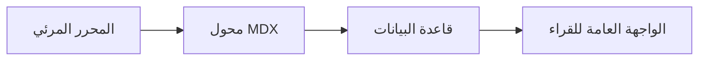

# دليل النشر الرقمي الشامل: من الفكرة إلى الإنتاج الحتمي

تعتبر منظومة النشر الحديثة ركيزة المحتوى المستقل على شبكة الويب، حيث تتطلب مقروئية فائقة وتصميماً هندسياً دقيقاً.

<Callout type="info" title="مبدأ المعمارية الأساسي">
الوثيقة المصدرية هي المرجع الأوحد (Single Source of Truth)؛ وتوليد المشتقات يتم بشكل ذري حتمي.
</Callout>

## 1. الأداء والطباعة التحريرية

الحرف العربي يحتاج إلى عناية خاصة عند عرضه على الشاشات الحديثة:

* استخدام خطوط واضحة مثل `IBM Plex Sans Arabic`.
* ضبط المسافة بين الأسطر بنسبة لا تقل عن `1.85`.
* تفعيل التنسيق الانسيابي ثنائي الاتجاه.

<PullQuote quote="التصميم ليس ما يبدو أو يُشعر به، التصميم هو كيف يعمل" author="ستيف جوبز" />

### مواصفات الخطوط والشبكة

| الخاصية الطباعية | القيمة المعتمدة | الملاحظات التحريرية |
| :--- | :--- | :--- |
| عائلة الخط | IBM Plex Sans Arabic | متوافق مع نظام التصميم |
| ارتفاع السطر | 1.85 | راحة بصرية فائقة |
| عرض السطر الأقصى | 68ch | معيار القراءة الذهبي |

## 2. الرسوم البيانية والمعمارية الموزعة

يوضح المخطط التالي دورة معالجة المقال عند النشر[^pipeline]:



<Figure src="https://images.unsplash.com/photo-1544716278-ca5e3f4abd8c" alt="لقطة توضيحية لواجهة المحرر الجديد" caption="محرر المقالات الغني مع دعم العربية من اليمين إلى اليسار" />

```typescript
export function calculateReadingTime(wordCount: number): number {
  const wordsPerMinute = 200;
  return Math.ceil(wordCount / wordsPerMinute);
}
```

---

خاتمة: الاستثمار في جودة القراءة هو جوهر استدامة منصات النشر المعرفي المستقلة.

[^pipeline]: تتم عملية الترجمة إلى المشتقات الثلاثة عبر خادم الويب بدون تحميل المتصفح أي عبء إضافي.
